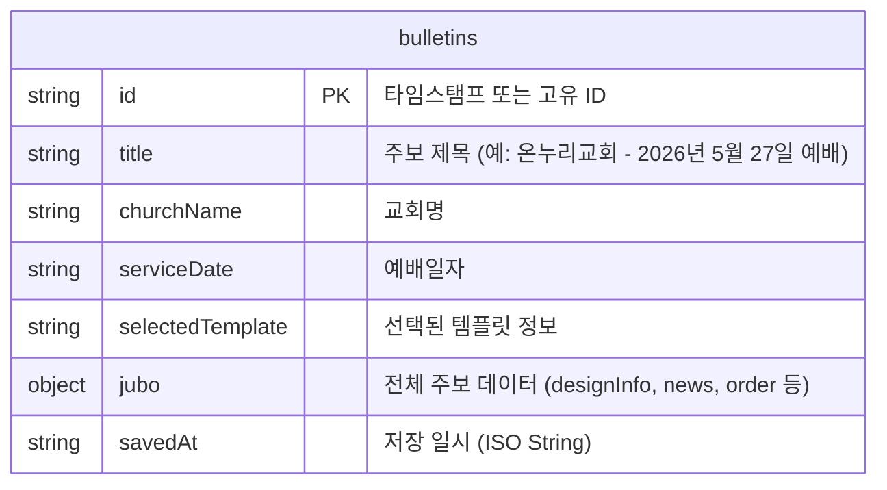
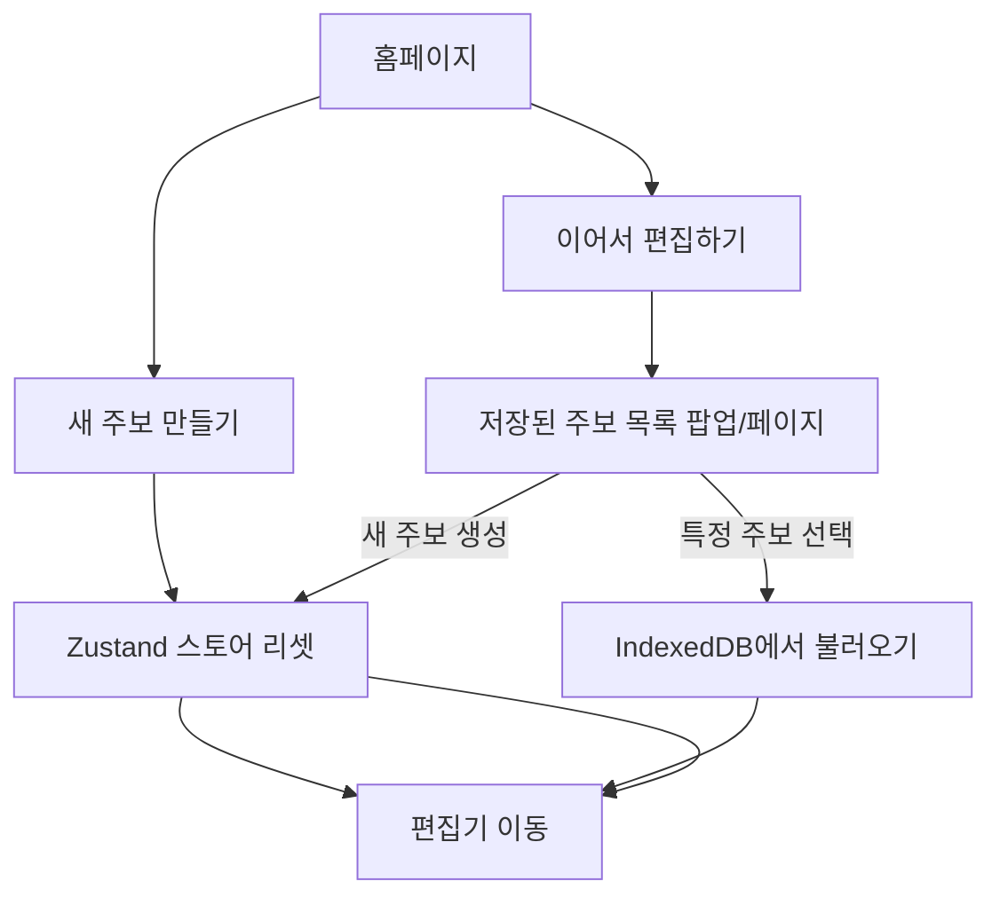

# JUBO - IndexedDB 도입 및 데이터 관리 개선 계획서

본 문서는 JUBO(디지털 주보 제작 서비스)의 데이터 저장 방식을 기존 `localStorage`에서 **`IndexedDB`**로 전환하기 위한 기술적 배경, 데이터베이스 스키마 설계, 유틸리티 함수 구현 및 Zustand 스토어 연동 방안을 정의합니다.

---

## 1. 도입 배경 및 필요성

현재 JUBO 프로젝트는 사용자의 주보 작성 데이터를 브라우저의 `localStorage`에 저장하고 있습니다. 그러나 다음과 같은 한계와 문제점이 존재합니다.

| 비교 항목 | `localStorage` (현재) | `IndexedDB` (도입 예정) |
| :--- | :--- | :--- |
| **저장 용량** | 약 5MB (매우 제한적) | 브라우저 할당량 크기 (최소 수백 MB ~ 수 GB) |
| **데이터 타입** | 문자열(String)만 지원 | 객체(Object), 파일(Blob), ArrayBuffer 등 지원 |
| **동작 방식** | 동기식 (Main Thread 블로킹 발생 가능) | 비동기식 (대용량 읽기/쓰기 시에도 UI 부드러움) |
| **다중 버전 관리**| 키-값 구조 특성상 여러 문서 버전 관리가 번거로움 | 관계형에 가까운 객체 스토어로 다중 문서 관리 용이 |

### 💡 주요 해결 과제
주보의 배경 이미지 및 로고 이미지는 `imageOptimizer.js`를 거쳐 **Base64 문자열**로 변환되어 저장됩니다. 
- 이미지 크기가 클 경우, 1~2개의 주보 저장만으로도 `localStorage` 용량 한도(5MB)를 초과하여 `QuotaExceededError`가 발생할 가능성이 매우 높습니다.
- **IndexedDB**를 사용하면 용량 한도 문제를 근본적으로 해결할 수 있으며, 주보 디자인 데이터를 주차별(또는 회차별)로 여러 개 저장하고 관리할 수 있게 됩니다.

---

## 2. 데이터베이스 스키마 설계 (IndexedDB Schema)

데이터베이스 이름은 `JuboDB`, 버전은 `1`로 설정하며, 주보 목록을 관리하기 위한 `bulletins` 객체 스토어(Object Store)를 생성합니다.



### 상세 필드 정보

*   **`id`** (KeyPath): 주보의 고유 식별자. 자동 생성하거나 타임스탬프(`Date.now().toString()`)를 키로 사용합니다.
*   **`title`**: 메인 홈이나 불러오기 목록 화면에서 식별하기 쉬운 이름.
*   **`churchName`**: `jubo.churchInfo.churchName` 값을 캐싱하여 목록 조회 시 성능 개선.
*   **`serviceDate`**: `jubo.worshipInfo.serviceDate` 값을 캐싱하여 목록을 날짜순으로 정렬할 때 활용.
*   **`selectedTemplate`**: 활성화된 템플릿 이름.
*   **`jubo`**: Zustand에서 사용 중인 전체 상태 객체 (`initialJuboState` 구조 전체).
*   **`savedAt`**: 최종 수정 시간.

---

## 3. IndexedDB 유틸리티 구현 (`src/utils/db.js`)

브라우저 내장 IndexedDB API를 쉽게 다룰 수 있도록 래핑한 유틸리티 클래스/객체를 작성합니다. 별도의 라이브러리 설치 없이 **Vanilla JavaScript IndexedDB API**를 활용하여 경량화를 유지합니다.

```javascript
// src/utils/db.js

const DB_NAME = "JuboDB";
const DB_VERSION = 1;
const STORE_NAME = "bulletins";

/**
 * IndexedDB 데이터베이스 연결을 초기화합니다.
 */
export const initDB = () => {
  return new Promise((resolve, reject) => {
    const request = indexedDB.open(DB_NAME, DB_VERSION);

    request.onerror = (event) => {
      console.error("IndexedDB 초기화 실패:", event.target.error);
      reject(event.target.error);
    };

    request.onsuccess = (event) => {
      resolve(event.target.result);
    };

    request.onupgradeneeded = (event) => {
      const db = event.target.result;
      if (!db.objectStoreNames.contains(STORE_NAME)) {
        // id를 keyPath로 사용하는 Object Store 생성
        db.createObjectStore(STORE_NAME, { keyPath: "id" });
      }
    };
  });
};

/**
 * 새 주보 데이터를 저장하거나 기존 데이터를 수정합니다.
 */
export const saveBulletin = async (bulletin) => {
  const db = await initDB();
  return new Promise((resolve, reject) => {
    const transaction = db.transaction([STORE_NAME], "readwrite");
    const store = transaction.objectStore(STORE_NAME);
    
    // 저장 시간 기록
    bulletin.savedAt = new Date().toISOString();
    
    const request = store.put(bulletin); // keyPath가 id이므로 id가 같으면 덮어쓰고 없으면 추가됨

    request.onsuccess = () => resolve(true);
    request.onerror = (e) => reject(e.target.error);
  });
};

/**
 * 모든 주보 목록을 불러옵니다. (최신 저장 순서대로 정렬)
 */
export const getAllBulletins = async () => {
  const db = await initDB();
  return new Promise((resolve, reject) => {
    const transaction = db.transaction([STORE_NAME], "readonly");
    const store = transaction.objectStore(STORE_NAME);
    const request = store.getAll();

    request.onsuccess = () => {
      const result = request.result;
      // 최근 저장 시간 순으로 정렬
      result.sort((a, b) => new Date(b.savedAt) - new Date(a.savedAt));
      resolve(result);
    };
    request.onerror = (e) => reject(e.target.error);
  });
};

/**
 * 특정 ID의 주보 데이터를 불러옵니다.
 */
export const getBulletinById = async (id) => {
  const db = await initDB();
  return new Promise((resolve, reject) => {
    const transaction = db.transaction([STORE_NAME], "readonly");
    const store = transaction.objectStore(STORE_NAME);
    const request = store.get(id);

    request.onsuccess = () => resolve(request.result);
    request.onerror = (e) => reject(e.target.error);
  });
};

/**
 * 특정 ID의 주보 데이터를 삭제합니다.
 */
export const deleteBulletinById = async (id) => {
  const db = await initDB();
  return new Promise((resolve, reject) => {
    const transaction = db.transaction([STORE_NAME], "readwrite");
    const store = transaction.objectStore(STORE_NAME);
    const request = store.delete(id);

    request.onsuccess = () => resolve(true);
    request.onerror = (e) => reject(e.target.error);
  });
};
```

---

## 4. Zustand Store 연동 (`src/stores/useJuboStore.jsx`)

Zustand 스토어 내부 상태에 `id` 정보를 추가하고, `db.js` 유틸리티를 호출하는 액션을 결합하여 로컬 스토리지 방식을 완전히 대체하거나 병행합니다.

### 4.1 스토어 상태 확장
```javascript
// 기존 스토어에 currentId 추가
const useJuboStore = create((set, get) => ({
  currentId: null, // 현재 편집 중인 주보 ID
  jubo: initialJuboState,
  selectedTemplate: "",
  
  // 현재 작성 상태를 새 주보로 리셋
  resetJubo: () => set({ 
    currentId: null, 
    jubo: initialJuboState, 
    selectedTemplate: "📋 기본 템플릿" 
  }),
  
  // ... 생략 ...
```

### 4.2 스토어 내 IndexedDB 저장/불러오기 액션 추가
```javascript
import { saveBulletin, getBulletinById } from "../utils/db";

// 스토어 내부 메서드 구현 예시
const useJuboStore = create((set, get) => ({
  // ... 기존 상태 ...
  
  // IndexedDB에 저장
  saveToIndexedDB: async () => {
    const { currentId, jubo, selectedTemplate } = get();
    
    // 만약 현재 주보 ID가 없는 경우 새로 생성
    const id = currentId || `jubo_${Date.now()}`;
    const churchName = jubo.churchInfo.churchName || "새로운 교회";
    const serviceDate = jubo.worshipInfo.serviceDate || "";
    const title = `${churchName} - ${serviceDate || "날짜 미정"} 주보`;

    const bulletinData = {
      id,
      title,
      churchName,
      serviceDate,
      selectedTemplate,
      jubo
    };

    try {
      await saveBulletin(bulletinData);
      set({ currentId: id });
      alert("IndexedDB에 저장 완료!");
      return true;
    } catch (e) {
      console.error(e);
      alert("저장 중 오류가 발생했습니다.");
      return false;
    }
  },

  // IndexedDB에서 특정 주보 로드
  loadFromIndexedDB: async (id) => {
    try {
      const data = await getBulletinById(id);
      if (data) {
        set({
          currentId: data.id,
          jubo: data.jubo,
          selectedTemplate: data.selectedTemplate
        });
        return true;
      }
      return false;
    } catch (e) {
      console.error("데이터 로드 실패:", e);
      return false;
    }
  }
}));
```

---

## 5. UI/UX 통합 시나리오 및 흐름도

IndexedDB 전환과 함께 다중 주보 저장 리스트를 관리할 수 있는 흐름이 만들어집니다.

### 5.1 홈 화면 (HomePage)
*   **기존**: "이어서 편집하기" 클릭 시 무조건 `localStorage`에서 단 하나의 상태를 가져옴.
*   **변경 후**: "이어서 편집하기"를 클릭하면 모달 또는 전용 페이지를 띄워 **[저장된 주보 목록]**을 표시하고, 원하는 주보(예: "5월 17일 예배 주보", "5월 24일 예배 주보" 등)를 선택하여 작업할 수 있도록 유도합니다.



### 5.2 편집 화면 (EditorPage)
*   **저장 버튼**: 클릭 시 IndexedDB로 비동기 저장이 되며, 화면 멈춤(렉) 현상이 전혀 발생하지 않습니다.
*   **자동 저장 (Auto-save)**: 사용자가 입력 항목을 바꿀 때마다 혹은 30초 주기로 IndexedDB에 자동 임시 저장을 수행하여 불의의 브라우저 종료 시 데이터를 완벽히 보호할 수 있습니다.

---

## 6. 향후 확장 및 최적화 고려 사항 (Blob 스토리지)

*   **Base64 vs Blob**: 
    현재는 이미지를 Base64 인코딩 문자열 형태로 `jubo.designInfo.logoInfo.logo` 및 `backgroundInfo.backgroundImage`에 저장하고 있습니다. IndexedDB는 **Blob 객체**를 그대로 다룰 수 있으므로, 이미지를 파일 개체(Blob) 형식 그대로 DB 스토어에 보관하게 개선하면 데이터 크기를 약 33% 줄이고(Base64 인코딩 오버헤드 제거), 렌더링 성능을 추가적으로 끌어올릴 수 있습니다.
